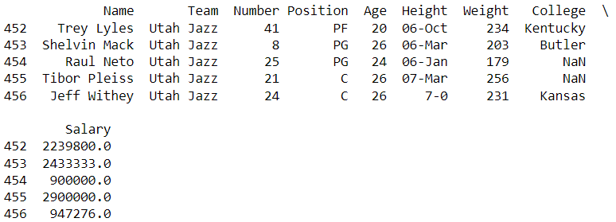

# Read-from-CSV

## AIM:
To write a program to read a content from a CSV file.
## ALGORITHM:
### Step 1:
Import the Pandas library with the alias 'pd'.
### Step 2:
Use the 'pd.read_csv()' function to read the "nba.csv" file located at "C:/Users/admin/Downloads/nba.csv" into a DataFrame object named 'df'.
### Step 3:
Print the first 10 rows of the DataFrame using the 'head()' method.
### Step 4:
 Print the last 5 rows of the DataFrame using the 'tail()' method.
### Step 5:
Print the number of rows and columns in the DataFrame using the 'len()' function along with the 'axes' attribute.

## PROGRAM:
```
/*
To write a program for reading content from a CSV file:
Developed by: S.Sajetha
Register number: 212223100049
*/
```
```
import pandas as pd
df = pd.read_csv("C:/Users/admin/Downloads/nba.csv")
print(df.head(10))
print(df.tail())
print("Number of rows:", len(df.axes[0]))
print("Number of columns:", len(df.axes[1]))
```
## OUTPUT:
### Head:

### Tail:

### No of rows and columns:

## RESULT:
Thus a program for reading content from a CSV file is executed successfully. 